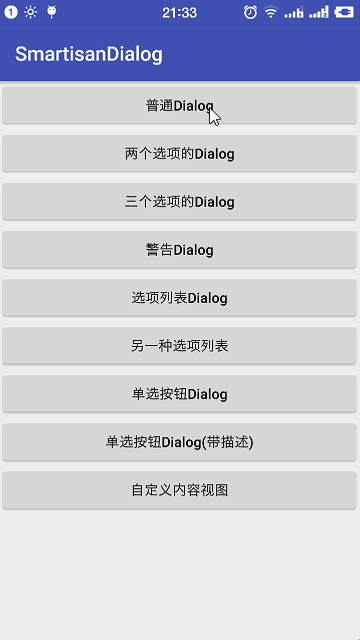
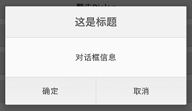
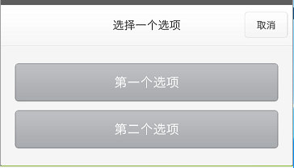
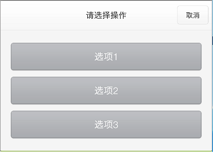
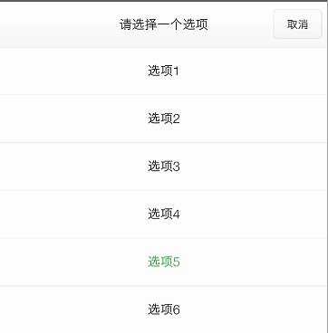
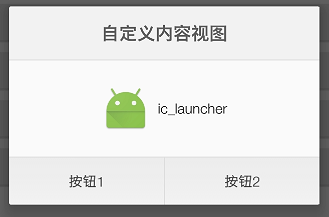

SmartisanDialog
========
> Smartisan风格的Dialog。  
> [Download Demo Apk](https://raw.githubusercontent.com/liying2008/SmartisanDialog/master/app/app-debug.apk)

屏幕截图(Screenshots)
----


引入(Download)
----
## Use Gradle  
```gradle  
compile 'cc.duduhuo.dialog:smartisan-dialog:1.0.0'
```

## Or Maven  
```xml  
<dependency>
  <groupId>cc.duduhuo.dialog</groupId>
  <artifactId>smartisan-dialog</artifactId>
  <version>1.0.0</version>
  <type>pom</type>
</dependency>
```

使用(Usage)
----

- 显示普通Dialog

```java  
final NormalDialog dialog = SmartisanDialog.createNormalDialog(this);
dialog.setTitle("这是标题")
    .setMsg("对话框信息")
    .setMsgGravity(Gravity.CENTER)
    .setLeftBtnText("确定")   // 设置文本的按钮会显示，不设置文本则不显示
    .setRightBtnText("取消")
    .show();
// 设置点击监听（下同，不再解释）
dialog.setOnSelectListener(new NormalDialog.OnSelectListener() {
    @Override
    public void onLeftSelect() {
        Toast.makeText(MainActivity.this, "onLeftSelect", Toast.LENGTH_SHORT).show();
        dialog.dismiss();
    }

    @Override
    public void onRightSelect() {
        Toast.makeText(MainActivity.this, "onRightSelect", Toast.LENGTH_SHORT).show();
        dialog.dismiss();
    }
});
```

- 显示带两个选项的Dialog

```java  
final TwoOptionsDialog dialog = SmartisanDialog.createTwoOptionsDialog(this);
dialog.setTitle("选择一个选项")
    .setOp1Text("第一个选项")   // 设置第一个选项的文本
    .setOp2Text("第二个选项")   // 设置第二个选项的文本
    .show();
dialog.setOnSelectListener(new TwoOptionsDialog.OnSelectListener() {
    @Override
    public void onOp1() {
        Toast.makeText(MainActivity.this, "onOp1", Toast.LENGTH_SHORT).show();
        dialog.dismiss();
    }

    @Override
    public void onOp2() {
        Toast.makeText(MainActivity.this, "onOp2", Toast.LENGTH_SHORT).show();
        dialog.dismiss();
    }
});

```
- 显示带三个选项的Dialog

```java  
final ThreeOptionsDialog dialog = SmartisanDialog.createThreeOptionsDialog(this);
dialog.setOp1Text("选项1")
    .setOp2Text("选项2")
    .setOp3Text("选项3")
    .show();
dialog.setOnSelectListener(new ThreeOptionsDialog.OnSelectListener() {
    @Override
    public void onOp1() {
        Toast.makeText(MainActivity.this, "onOp1", Toast.LENGTH_SHORT).show();
        dialog.dismiss();
    }

    @Override
    public void onOp2() {
        Toast.makeText(MainActivity.this, "onOp2", Toast.LENGTH_SHORT).show();
        dialog.dismiss();
    }

    @Override
    public void onOp3() {
        Toast.makeText(MainActivity.this, "onOp3", Toast.LENGTH_SHORT).show();
        dialog.dismiss();
    }
});
```
- 显示警告Dialog

```java  
final WarningDialog dialog = SmartisanDialog.createWarningDialog(this);
dialog.setTitle("确定退出登录吗")
    .setConfirmText("退出登录")
    .show();
dialog.setOnConfirmListener(new WarningDialog.OnConfirmListener() {
    @Override
    public void onConfirm() {
        Toast.makeText(MainActivity.this, "onConfirm", Toast.LENGTH_SHORT).show();
        dialog.dismiss();
    }
});

```
- 显示选项列表Dialog

```java  
List<String> options = new ArrayList<>(6);
options.add("选项1");
options.add("选项2");
options.add("选项3");
options.add("选项4");
options.add("选项5");
options.add("选项6");
final OptionListDialog dialog = SmartisanDialog.createOptionListDialog(this);
dialog.setTitle("请选择一个选项")
    .setOptionList(options)
    .setLastOption("选项5")   // 上次选择的选项
    .setItemGravity(Gravity.CENTER) // Item是居左、居中还是居右
    .setLastColor(0xFF40B64A)   // 上次选择的选项显示的颜色，用于区分
    .show();
// setOnOptionItemSelectListener()方法必须在show()方法之后调用，否则无效
dialog.setOnOptionItemSelectListener(new OnOptionItemSelectListener() {
    @Override
    public void onSelect(int position, CharSequence option) {
        Toast.makeText(MainActivity.this, "position = " + position + ", option = " + option, Toast.LENGTH_SHORT).show();
        dialog.dismiss();
    }
});
```
- 可以自定义Dialog的内容视图

```java  
final CustomizedDialog dialog = SmartisanDialog.createCustomizedDialog(this);
View rootView = getLayoutInflater().inflate(R.layout.test_view, null);
dialog.addView(rootView)
    .setTitle("自定义内容视图")
    .setLeftBtnText("按钮1")  // 设置文本的按钮会显示，不设置文本则不显示
    .setRightBtnText("按钮2")
    .show();
dialog.setOnSelectListener(new CustomizedDialog.OnSelectListener() {
    @Override
    public void onLeftSelect() {
        Toast.makeText(MainActivity.this, "onLeftSelect", Toast.LENGTH_SHORT).show();
        dialog.dismiss();
    }

    @Override
    public void onRightSelect() {
        Toast.makeText(MainActivity.this, "onRightSelect", Toast.LENGTH_SHORT).show();
        dialog.dismiss();
    }
});

```

样式预览
----

| 样式 | 预览
| :--- | :--: 
| NormalDialog | 
| TwoOptionsDialog | 
| ThreeOptionsDialog | 
| WarningDialog | 
| OptionListDialog | 
| CustomizedDialog | 


作者(Author)
---- 
新浪微博：[@独毒火][2]  
邮箱：[liruoer2008@yeah.net][3]

日期(Date)
----
2017-5-13

License
----

	Copyright 2017 LiYing
	
	Licensed under the Apache License, Version 2.0 (the "License");
	you may not use this file except in compliance with the License.
	You may obtain a copy of the License at
	
	   http://www.apache.org/licenses/LICENSE-2.0
	
	Unless required by applicable law or agreed to in writing, software
	distributed under the License is distributed on an "AS IS" BASIS,
	WITHOUT WARRANTIES OR CONDITIONS OF ANY KIND, either express or implied.
	See the License for the specific language governing permissions and
	limitations under the License.


  [2]: http://weibo.com/neuliying
  [3]: mailto:liruoer2008@yeah.net
