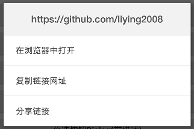
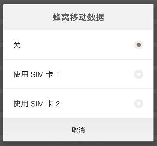
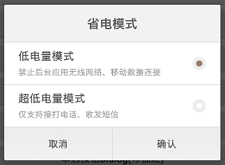

SmartisanDialog - Smartisan风格的Dialog。
=======
[](https://bintray.com/liying2008/smartisan-dialog/smartisan-dialog/_latestVersion)
[](https://github.com/liying2008/SmartisanDialog/blob/master/LICENSE)
[](http://weibo.com/neuliying)

### [Download Demo Apk](https://raw.githubusercontent.com/liying2008/SmartisanDialog/master/app/app-debug.apk)

屏幕截图(Screenshots)
----


引入(Download)
----
## Use Gradle  
```gradle  
compile 'cc.duduhuo.dialog:smartisan-dialog:1.1.0'
```

## Or Maven  
```xml  
<dependency>
  <groupId>cc.duduhuo.dialog</groupId>
  <artifactId>smartisan-dialog</artifactId>
  <version>1.1.0</version>
  <type>pom</type>
</dependency>
```

使用(Usage)
----

### 显示普通Dialog


```java  
final NormalDialog dialog = SmartisanDialog.createNormalDialog(this);
dialog.setTitle("这是标题")
    .setMsg("对话框信息")
    .setMsgGravity(Gravity.CENTER)
    .setLeftBtnText("确定")   // 设置文本的按钮会显示，不设置文本则不显示
    .setRightBtnText("取消")
    .show();
// 设置点击监听（下同，不再解释）
dialog.setOnSelectListener(new NormalDialog.OnSelectListener() {
    @Override
    public void onLeftSelect() {
        Toast.makeText(MainActivity.this, "onLeftSelect", Toast.LENGTH_SHORT).show();
        dialog.dismiss();
    }

    @Override
    public void onRightSelect() {
        Toast.makeText(MainActivity.this, "onRightSelect", Toast.LENGTH_SHORT).show();
        dialog.dismiss();
    }
});
```

### 显示带两个选项的Dialog


```java  
final TwoOptionsDialog dialog = SmartisanDialog.createTwoOptionsDialog(this);
dialog.setTitle("选择一个选项")
    .setOp1Text("第一个选项")   // 设置第一个选项的文本
    .setOp2Text("第二个选项")   // 设置第二个选项的文本
    .show();
dialog.setOnSelectListener(new TwoOptionsDialog.OnSelectListener() {
    @Override
    public void onOp1() {
        Toast.makeText(MainActivity.this, "onOp1", Toast.LENGTH_SHORT).show();
        dialog.dismiss();
    }

    @Override
    public void onOp2() {
        Toast.makeText(MainActivity.this, "onOp2", Toast.LENGTH_SHORT).show();
        dialog.dismiss();
    }
});

```

### 显示带三个选项的Dialog


```java  
final ThreeOptionsDialog dialog = SmartisanDialog.createThreeOptionsDialog(this);
dialog.setOp1Text("选项1")
    .setOp2Text("选项2")
    .setOp3Text("选项3")
    .show();
dialog.setOnSelectListener(new ThreeOptionsDialog.OnSelectListener() {
    @Override
    public void onOp1() {
        Toast.makeText(MainActivity.this, "onOp1", Toast.LENGTH_SHORT).show();
        dialog.dismiss();
    }

    @Override
    public void onOp2() {
        Toast.makeText(MainActivity.this, "onOp2", Toast.LENGTH_SHORT).show();
        dialog.dismiss();
    }

    @Override
    public void onOp3() {
        Toast.makeText(MainActivity.this, "onOp3", Toast.LENGTH_SHORT).show();
        dialog.dismiss();
    }
});
```

### 显示警告Dialog


```java  
final WarningDialog dialog = SmartisanDialog.createWarningDialog(this);
dialog.setTitle("确定退出登录吗")
    .setConfirmText("退出登录")
    .show();
dialog.setOnConfirmListener(new WarningDialog.OnConfirmListener() {
    @Override
    public void onConfirm() {
        Toast.makeText(MainActivity.this, "onConfirm", Toast.LENGTH_SHORT).show();
        dialog.dismiss();
    }
});

```

### 显示选项列表Dialog


```java  
String[] options = new String[]{"选项1", "选项2", "选项3", "选项4", "选项5", "选项6"};
final OptionListDialog dialog = SmartisanDialog.createOptionListDialog(this);
dialog.setTitle("请选择一个选项")
    .setOptionList(options)
    .setLastOption("选项5")   // 上次选择的选项
    .setItemGravity(Gravity.CENTER) // Item是居左、居中还是居右
    .setLastColor(0xFF40B64A)   // 上次选择的选项显示的颜色，用于区分
    .show();
// setOnOptionItemSelectListener()方法必须在show()方法之后调用，否则无效
dialog.setOnOptionItemSelectListener(new OnOptionItemSelectListener() {
    @Override
    public void onSelect(int position, CharSequence option) {
        Toast.makeText(MainActivity.this, "position = " + position + ", option = " + option, Toast.LENGTH_SHORT).show();
        dialog.dismiss();
    }
});
```

### 通过隐藏单选按钮图标，显示另一种选项列表Dialog



```java
String[] options = {"在浏览器中打开", "复制链接网址", "分享链接"};
final SingleChoiceDialog dialog = SmartisanDialog.createSingleChoiceDialog(this);
dialog.setTitle("https://github.com/liying2008")
    .setSingleChoiceItems(options, -1) // -1表示没有默认选中项
    .setTitleTextSize(16)
    .hideRadioIcon()  // 隐藏单选按钮图标
    .show();
// setOnSingleChoiceSelectListener()方法必须在show()方法之后调用，否则无效
dialog.setOnSingleChoiceSelectListener(new OnSingleChoiceSelectListener() {
    @Override
    public void onSelect(int position) {
        Toast.makeText(MainActivity.this, "position = " + position, Toast.LENGTH_SHORT).show();
        dialog.dismiss();
    }
});
```

### 显示单选列表Dialog



```java
final SingleChoiceDialog dialog = SmartisanDialog.createSingleChoiceDialog(this);
dialog.setTitle("蜂窝移动数据")
    .setLeftBtnText("取消")
    .setSingleChoiceItems(new String[]{"关", "使用 SIM 卡 1", "使用 SIM 卡 2"}, 0)
    .show();
dialog.setOnSingleChoiceSelectListener(new OnSingleChoiceSelectListener() {
    @Override
    public void onSelect(int position) {
        Toast.makeText(MainActivity.this, "position = " + position, Toast.LENGTH_SHORT).show();
        dialog.dismiss();
    }
});
dialog.setOnBtnSelectListener(new SingleChoiceDialog.OnBtnSelectListener() {
    @Override
    public void onLeftSelect() {
        dialog.dismiss();
    }

    @Override
    public void onRightSelect() {

    }
});
```

### 显示带描述的单选列表Dialog



```java
String[] items = new String[]{"低电量模式", "超低电量模式"};
String[] descs = new String[]{"禁止后台应用无线网络、移动数据连接", "仅支持接打电话、收发短信"};
final SingleChoiceDialog dialog = SmartisanDialog.createSingleChoiceDialog(this);
dialog.setTitle("省电模式")
    .setLeftBtnText("取消")
    .setRightBtnText("确认")
    .setSingleChoiceItems(items, descs, 0)
    .show();
dialog.setOnSingleChoiceSelectListener(new OnSingleChoiceSelectListener() {
    @Override
    public void onSelect(int position) {
        Toast.makeText(MainActivity.this, "position = " + position, Toast.LENGTH_SHORT).show();
    }
});
dialog.setOnBtnSelectListener(new SingleChoiceDialog.OnBtnSelectListener() {
    @Override
    public void onLeftSelect() {
        dialog.dismiss();
    }

    @Override
    public void onRightSelect() {
        Toast.makeText(MainActivity.this, "已应用", Toast.LENGTH_SHORT).show();
        dialog.dismiss();
    }
});
```

### 可以自定义Dialog的内容视图


```java  
final CustomizedDialog dialog = SmartisanDialog.createCustomizedDialog(this);
View rootView = getLayoutInflater().inflate(R.layout.test_view, null);
dialog.addView(rootView)
    .setTitle("自定义内容视图")
    .show();
```

更新日志(ChangeLog)
----
[点击查看更新日志](CHANGELOG.md)

作者(Author)
---- 
新浪微博：[@独毒火](http://weibo.com/neuliying)

邮箱：[liruoer2008@yeah.net](mailto:liruoer2008@yeah.net)

日期(Date)
----
2017-10-21

License
----

	Copyright 2017 LiYing
	
	Licensed under the Apache License, Version 2.0 (the "License");
	you may not use this file except in compliance with the License.
	You may obtain a copy of the License at
	
	   http://www.apache.org/licenses/LICENSE-2.0
	
	Unless required by applicable law or agreed to in writing, software
	distributed under the License is distributed on an "AS IS" BASIS,
	WITHOUT WARRANTIES OR CONDITIONS OF ANY KIND, either express or implied.
	See the License for the specific language governing permissions and
	limitations under the License.

